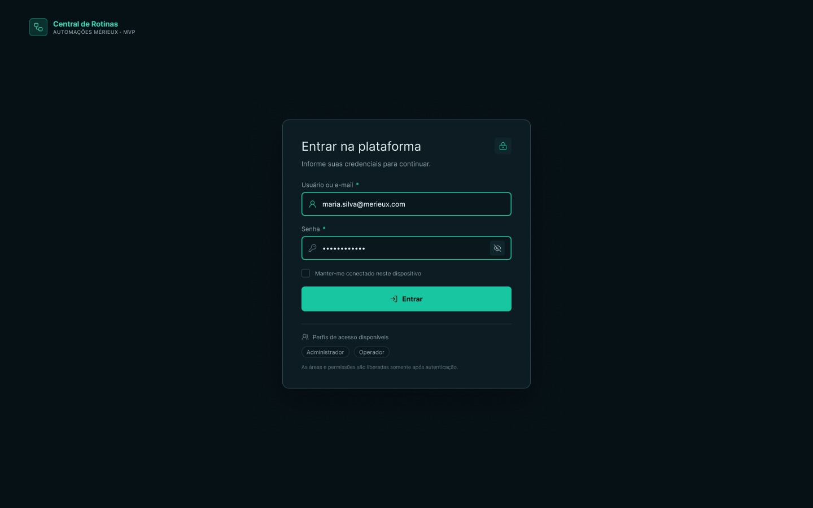
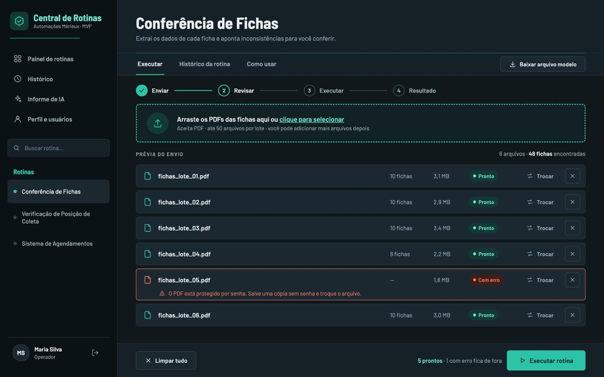
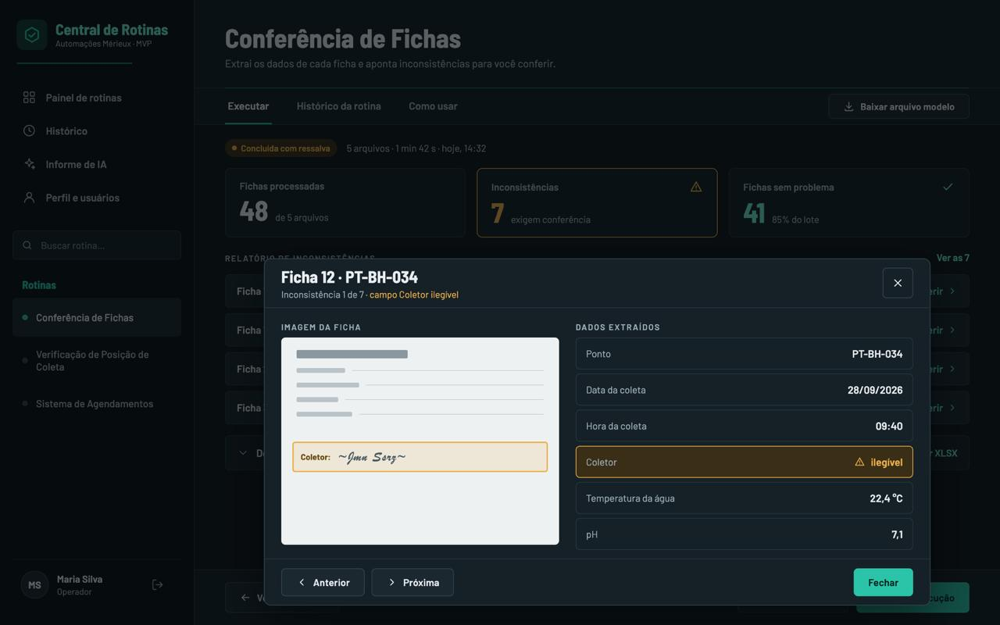
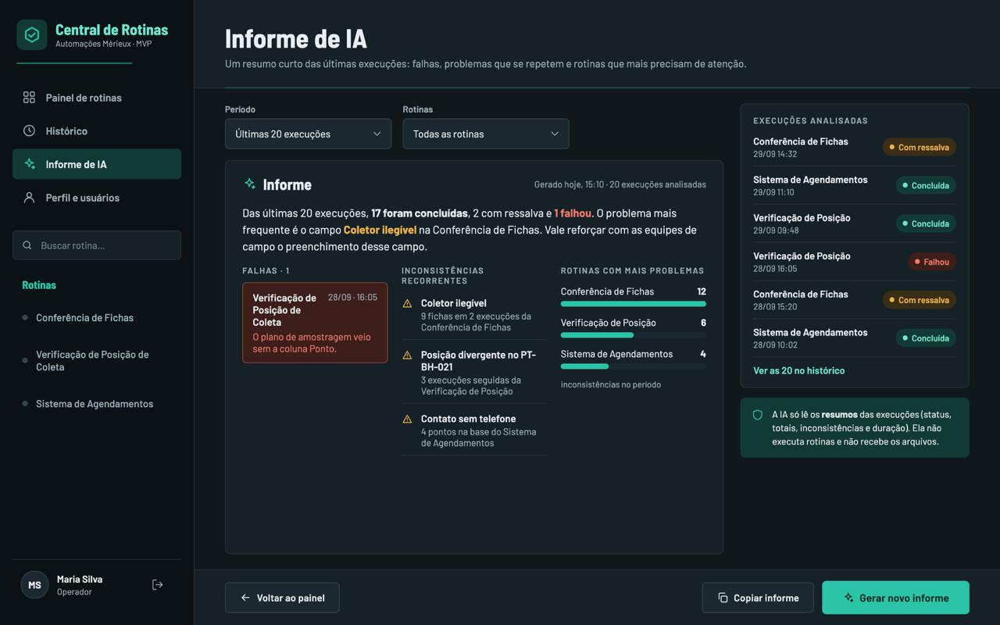
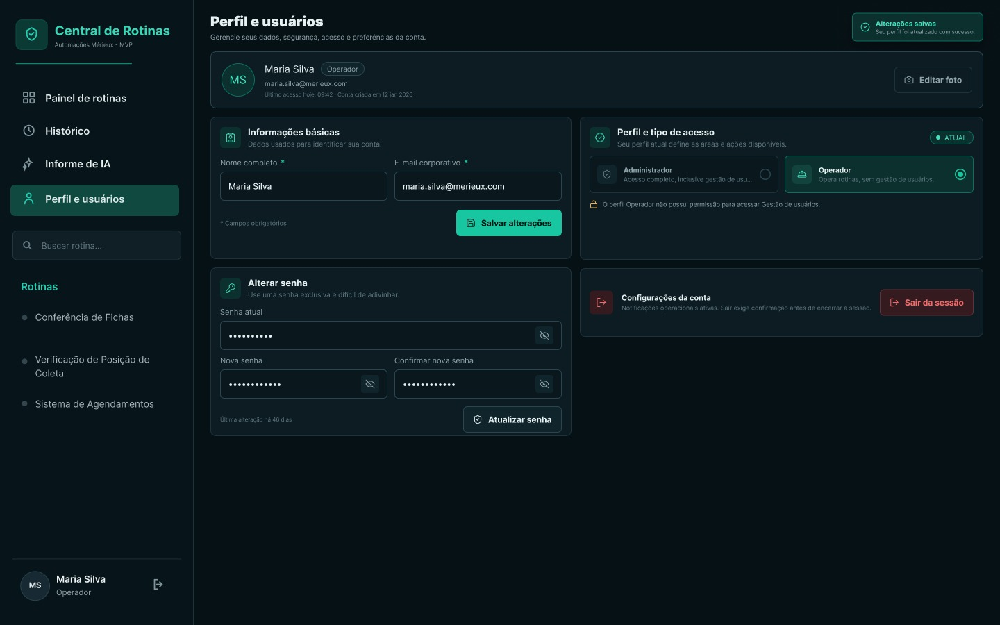

# 3. Protótipo (Mockup)

## **Tela 01 - Login / Início**

<figure><figcaption></figcaption></figure>

Login / Início

**Elementos da tela**

* Título: "Entrar na plataforma" (com ícone de cadeado) — "Informe suas credenciais para continuar."
* Campo "Usuário ou e-mail" (obrigatório, marcado com \*)
* Campo "Senha" (obrigatório, marcado com \*), com botão de mostrar/ocultar senha
* Opção "Manter-me conectado neste dispositivo"
* Botão "Entrar"
* "Perfis de acesso disponíveis": Administrador · Operador
* Aviso: "As áreas e permissões são liberadas somente após autenticação."

**Correspondência com os requisitos**

* RF01: login com usuário e senha; diferenciação dos perfis Operador e Administrador.
* RF01 (aceite): um usuário não autenticado não acessa nenhuma tela além do login — informado na tela por "As áreas e permissões são liberadas somente após autenticação."
* RNF03: senhas armazenadas com hash bcrypt, sessão autenticada por token e comunicação sob HTTPS. Atendido na arquitetura: Nginx com HTTPS e módulo de Autenticação e perfis com JWT + bcrypt (seção 5).

## **Tela 02 - Função Principal**

<figure><figcaption></figcaption></figure>

Função Principal — Envio e prévia (Conferência de Fichas)

**Elementos da tela**

* Cabeçalho da rotina: "Extrai os dados de cada ficha e aponta inconsistências para você conferir."
* Abas: Executar · Histórico da rotina · Como usar
* Botão "Baixar arquivo modelo"
* Etapas: Enviar → Revisar → Executar → Resultado
* Área de envio: "Arraste os PDFs das fichas aqui ou clique para selecionar" — "Aceita PDF · até 50 arquivos por lote · você pode adicionar mais arquivos depois"
* Prévia do envio: "6 arquivos · 48 fichas encontradas". Cada arquivo mostra quantidade de fichas, tamanho, status (Pronto / Com erro) e as ações Trocar e remover.
* Arquivo com erro: "O PDF está protegido por senha. Salve uma cópia sem senha e troque o arquivo."
* Rodapé: "Limpar tudo" · "5 prontos · 1 com erro fica de fora" · "Executar rotina"

**Correspondência com os requisitos**

* RF03: envio por arrastar e soltar ou por seleção; download do arquivo modelo; arquivo inválido recusado com mensagem que diz o que está errado e como corrigir.
* RF04: prévia com a lista dos arquivos; remover ou trocar arquivos sem recomeçar.
* RF05: disparo da rotina com um único botão.

## **Tela 03 - Resultado / Saída**&#x20;

<figure><figcaption></figcaption></figure>

Resultado / Saída — Conferência de Fichas

**Elementos da tela**

* Status: "Concluída com ressalva · 5 arquivos · 1 min 42 s · hoje, 14:32"
* Zona 1 — Resumo (cards): Fichas processadas **48** (de 5 arquivos) · Inconsistências **7** (exigem conferência) · Fichas sem problema **41** (85% do lote)
* Zona 2 — Visualização principal: Relatório de inconsistências ("Ver as 7")
* Zona 3 — Detalhe: recolhido, com exportação XLSX (parcialmente coberto pelo pop-up)

**Pop-up de conferência**&#x20;

* Título: "Ficha 12 · PT-BH-034" — "Inconsistência 1 de 7 · campo Coletor ilegível"
* Imagem da ficha, com o campo Coletor destacado
* Dados extraídos: Ponto PT-BH-034 · Data da coleta 28/09/2026 · Hora da coleta 09:40 · **Coletor: ilegível** (destacado) · Temperatura da água 22,4 °C · pH 7,1
* Botões: Anterior · Próxima · Fechar

**Correspondência com os requisitos**

* RF06: resultado nas três zonas do padrão de módulo; o usuário identifica o que exige ação sem abrir a tabela de detalhe.

## **Tela 04 - Tela de Ação da IA**

<figure><figcaption></figcaption></figure>

Tela de Ação da IA — Informe de IA

**Elementos da tela**

* Subtítulo: "Um resumo curto das últimas execuções: falhas, problemas que se repetem e rotinas que mais precisam de atenção."
* Filtros: Período ("Últimas 20 execuções") · Rotinas ("Todas as rotinas")
* Informe: "Gerado hoje, 15:10 · 20 execuções analisadas"
* Texto: "Das últimas 20 execuções, 17 foram concluídas, 2 com ressalva e 1 falhou. O problema mais frequente é o campo Coletor ilegível na Conferência de Fichas. Vale reforçar com as equipes de campo o preenchimento desse campo."
* Falhas (1): Verificação de Posição de Coleta — 28/09, 16:05 — "O plano de amostragem veio sem a coluna Ponto."
* Inconsistências recorrentes: Coletor ilegível (9 fichas em 2 execuções da Conferência de Fichas) · Posição divergente no PT-BH-021 (3 execuções seguidas da Verificação de Posição) · Contato sem telefone (4 pontos na base do Sistema de Agendamentos)
* Rotinas com mais problemas (inconsistências no período): Conferência de Fichas 12 · Verificação de Posição 6 · Sistema de Agendamentos 4
* Painel lateral "Execuções analisadas", com rotina, data/hora e status, e o link "Ver as 20 no histórico"
* Aviso: "A IA só lê os resumos das execuções (status, totais, inconsistências e duração). Ela não executa rotinas e não recebe os arquivos."
* Botões: Voltar ao painel · Copiar informe · Gerar novo informe

**Correspondência com os requisitos**

* RF08: informe sob demanda que aponta falhas, inconsistências recorrentes e rotinas com mais problemas; a IA apenas lê e resume os dados.
* RNF05: o Informe de IA recebe apenas resumos estruturados.

## **Tela 05 - Configurações / Perfil**

<figure><figcaption></figcaption></figure>

Configurações / Perfil

**Elementos da tela**

* Título: "Perfil e usuários" — "Gerencie seus dados, segurança, acesso e preferências da conta."
* Confirmação: "Alterações salvas — Seu perfil foi atualizado com sucesso."
* Cabeçalho do usuário: Maria Silva, selo "Operador", maria.silva@merieux.com, "Último acesso hoje, 09:42 · Conta criada em 12 jan 2026", botão "Editar foto"
* **Informações básicas** — "Dados usados para identificar sua conta."
  * Nome completo (obrigatório) · E-mail corporativo (obrigatório)
  * "\* Campos obrigatórios" · botão "Salvar alterações"
* **Perfil e tipo de acesso** — "Seu perfil atual define as áreas e ações disponíveis." (selo "ATUAL")
  * Administrador: "Acesso completo, inclusive gestão de usuários"
  * Operador (selecionado): "Opera rotinas, sem gestão de usuários."
  * Aviso: "O perfil Operador não possui permissão para acessar Gestão de usuários."
* **Alterar senha** — "Use uma senha exclusiva e difícil de adivinhar."
  * Senha atual · Nova senha · Confirmar nova senha (todos com mostrar/ocultar senha)
  * "Última alteração há 46 dias" · botão "Atualizar senha"
* **Configurações da conta** — "Notificações operacionais ativas. Sair exige confirmação antes de encerrar a sessão." · botão "Sair da sessão"

**Correspondência com os requisitos**

* RF01 (Operador): altera a própria senha → bloco "Alterar senha".
* RF01 (perfis): diferenciação entre Operador e Administrador → bloco "Perfil e tipo de acesso".
* RF01 (Administrador): gerencia usuários → a tela informa que o perfil Operador não acessa Gestão de usuários.
