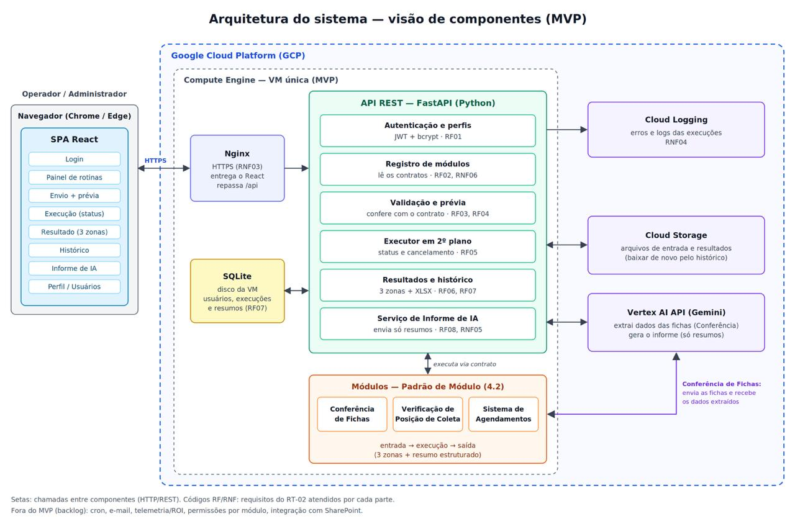

# 5. Diagrama de Arquitetura

<figure><figcaption></figcaption></figure>

## Componentes

**Operador / Administrador — Navegador (Chrome / Edge)** SPA React com as telas: Login · Painel de rotinas · Envio + prévia · Execução (status) · Resultado (3 zonas) · Histórico · Informe de IA · Perfil / Usuários.

**Google Cloud Platform (GCP) — Compute Engine, VM única (MVP)**

| Componente                                         | Função (conforme o diagrama)                                                                                                                  | Requisitos  |
| -------------------------------------------------- | --------------------------------------------------------------------------------------------------------------------------------------------- | ----------- |
| Nginx                                              | HTTPS; entrega o React; repassa /api                                                                                                          | RNF03       |
| API REST — FastAPI (Python): Autenticação e perfis | JWT + bcrypt                                                                                                                                  | RF01        |
| API: Registro de módulos                           | Lê os contratos                                                                                                                               | RF02, RNF06 |
| API: Validação e prévia                            | Confere com o contrato                                                                                                                        | RF03, RF04  |
| API: Executor em 2º plano                          | Status e cancelamento                                                                                                                         | RF05        |
| API: Resultados e histórico                        | 3 zonas + XLSX                                                                                                                                | RF06, RF07  |
| API: Serviço de Informe de IA                      | Envia só resumos                                                                                                                              | RF08, RNF05 |
| SQLite                                             | Disco da VM; usuários, execuções e resumos                                                                                                    | RF07        |
| Módulos — Padrão de Módulo                         | Conferência de Fichas · Verificação de Posição de Coleta · Sistema de Agendamentos; entrada → execução → saída (3 zonas + resumo estruturado) | —           |

## **Serviços do GCP**

| Serviço                | Função (conforme o diagrama)                                       | Requisitos |
| ---------------------- | ------------------------------------------------------------------ | ---------- |
| Cloud Logging          | Erros e logs das execuções                                         | RNF04      |
| Cloud Storage          | Arquivos de entrada e resultados (baixar de novo pelo histórico)   | —          |
| Vertex AI API (Gemini) | Extrai dados das fichas (Conferência); gera o informe (só resumos) | —          |

## Conexões

* Navegador ↔ Nginx: HTTPS
* Nginx → API REST
* API → Cloud Logging
* API ↔ SQLite
* API ↔ Cloud Storage
* API ↔ Vertex AI
* API ↔ Módulos: executa via contrato
* Módulos (Conferência de Fichas) ↔ Vertex AI: envia as fichas e recebe os dados extraídos

**Legenda:** setas representam chamadas entre componentes (HTTP/REST). Os códigos RF/RNF indicam os requisitos do RT-02 atendidos por cada parte.

**Fora do MVP (backlog):** cron, e-mail, telemetria/ROI, permissões por módulo, integração com SharePoint.
